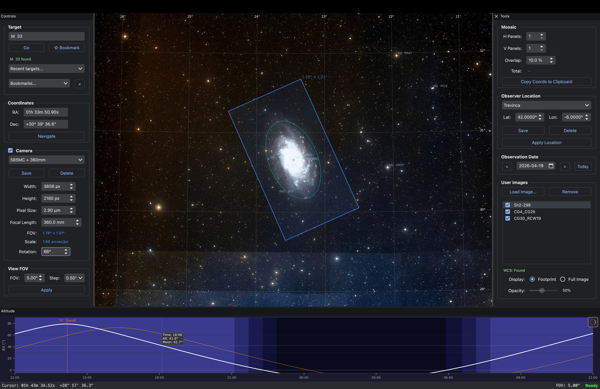

# Astro Framing Assistant

A cross-platform desktop tool for astrophotographers to frame deep-sky targets using offline sky tiles, plan mosaics, and check object visibility.



## Features

- **Offline sky rendering** — uses N.I.N.A.'s `FramingAssistantCache` tiles, no internet required
- **Catalog search** — 18,400+ deep-sky objects and 283,000+ aliases (Messier, NGC, IC, Sharpless, RCW, Gum, Barnard, LDN, LBN, Abell, and more) with autosuggest
- **Camera FOV overlay** — configurable sensor/focal-length profiles with rotation, toggle-on/off
- **Mosaic planner** — H×V panels with overlap, copy panel coordinates to clipboard
- **User image overlay** — load plate-solved XISF images and display them in their actual sky position
- **Observer locations** — save/load multiple observing sites; timezone auto-detected from coordinates
- **Altitude chart** — 24-hour target altitude curve with twilight shading, moon altitude curve with phase icon, hover tooltip showing time/altitude/moon
- **Bookmarks & recent targets** — quick navigation to saved and recently viewed objects
- **Session persistence** — target, FOV, camera profile, rotation, mosaic, observer location, and window geometry all restored on restart

## Installation

Download the latest release for your platform from the **[Releases page](https://github.com/HiranD/astro-framing-assistant/releases/latest)**.

### macOS

1. Download `AstroFramingAssistant-macOS.dmg`
2. Open the `.dmg` and drag the app to your `Applications` folder
3. **First launch:** right-click the app → **Open** (to bypass Gatekeeper, since the app is unsigned)

### Windows

1. Download `AstroFramingAssistant-Windows.zip`
2. Extract the zip anywhere you like
3. Run `AstroFramingAssistant.exe`
4. If Windows SmartScreen blocks the app: click **More info** → **Run anyway**. If Smart App Control blocks it entirely, retry in a few minutes — Microsoft's cloud service typically clears unsigned binaries after a short reputation check.

## Sky Tile Cache (required)

The app renders the sky background from N.I.N.A.'s offline `FramingAssistantCache` (~3.3 GB). Download it from:

**https://nighttime-imaging.eu/downloads/Setup/Releases/FramingAssistantCache_Full.zip**

Extract the zip and point the app to the resulting `FramingAssistantCache` folder on first launch (a dialog will prompt you).

## Usage

1. **Search a target** — type a name (e.g. `M 31`, `NGC 2359`, `RCW 85`) in the search bar. Autosuggest shows matching catalog entries.
2. **Adjust camera FOV** — set sensor width/height, pixel size, and focal length in the Camera panel. Save profiles for your gear.
3. **Rotate** — enter a camera rotation angle (0-360°).
4. **Plan a mosaic** — set H and V panels in the Tools panel on the right; the total FOV updates automatically.
5. **Check visibility** — the altitude chart at the bottom shows the target's altitude over 24 hours for your observer location, with twilight bands and moon altitude.
6. **Bookmark** — click the ☆ bookmark button in the search area to save the current target or coordinates.

## Development

Requires Python 3.10+, [`uv`](https://docs.astral.sh/uv/) for dependency management.

```bash
git clone https://github.com/HiranD/astro-framing-assistant.git
cd astro-framing-assistant
uv sync
uv run python run.py
```

### Building installers locally

```bash
uv pip install pyinstaller
pyinstaller astro_framing.spec --noconfirm
```

Output appears in `dist/Astro Framing Assistant.app` (macOS) or `dist/AstroFramingAssistant/` (Windows).

### Releasing

Push a tag matching `v*` (e.g. `git tag v0.1.4 && git push origin v0.1.4`). The GitHub Actions workflow builds macOS `.dmg` and Windows `.zip` artifacts and publishes a release.

## Tech stack

- [PyQt6](https://pypi.org/project/PyQt6/) — GUI
- [Matplotlib](https://matplotlib.org/) + [WCSAxes](https://docs.astropy.org/en/stable/visualization/wcsaxes/) — sky canvas
- [Astropy](https://www.astropy.org/) + [Astroplan](https://astroplan.readthedocs.io/) — coordinates, visibility, moon/sun
- [Reproject](https://reproject.readthedocs.io/) — WCS-aware tile mosaicing
- [XISF](https://pypi.org/project/xisf/) — PixInsight image loader
- [TimezoneFinder](https://pypi.org/project/timezonefinder/) — timezone auto-detection
- [PyInstaller](https://pyinstaller.org/) — cross-platform packaging

## Credits

- Sky tile cache by [N.I.N.A.](https://nighttime-imaging.eu/) — used with thanks
- Object catalog compiled from standard astronomical databases (Messier, NGC/IC, Sharpless, RCW, etc.)

## License

[MIT](LICENSE)
